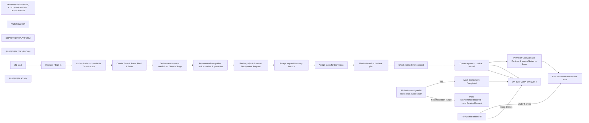

# CF1 - Farm & IoT Deployment

Source: `SmartFarm_Activity_Swimlane_Diagram.drawio`.

```mermaid
flowchart LR
  cf1_title["FARM MANAGEMENT, CULTIVATION & IoT DEPLOYMENT"]
  cf1_l1["FARM OWNER"]
  cf1_o1["Register / Sign in"]
  cf1_o4["Review, adjust & submit Deployment Request"]
  cf1_o2["Create Tenant, Farm, Field & Zone"]
  WLeVgwMjjXwK3G_euZHE_1["Owner agrees to contract terms?"]
  cf1_l2["SMARTFARM PLATFORM"]
  cf1_s1["Authenticate and establish Tenant scope"]
  cf1_s3["Recommend compatible device models & quantities"]
  cf1_s2["Derive measurement needs from Growth Stage"]
  cf1_s4["Mark deployment Completed"]
  Uyi_bU8Pv1RA_BfmlyZH_2["Uyi-bU8Pv1RA-BfmlyZH-2"]
  cf1_s5["Mark MaintenanceRequired + creat Service Request"]
  C_lrEX6fKDi4okM7vWty_10["Retry Limit Reached?"]
  cf1_l3["PLATFORM TECHNICIAN"]
  cf1_t2["Revise / confirm the final plan"]
  kKuCwVisD9lSDfv2SKvW_2["Check list node for contract"]
  cf1_t3["Provision Gateway and Devices & assign Nodes to Zone"]
  cf1_d1["All devices assigned &<br/>latest tests successful?"]
  cf1_t4["Run and record connection tests"]
  cf1_start["cf1-start"]
  WhK6Nxf7crYs8FIi9U0q_1["PLATFORM ADMIN"]
  XRe61GPQnEzf8RG_Tmsi_1["Accept request & survey the site"]
  XRe61GPQnEzf8RG_Tmsi_4["Assign tasks for technician"]
  cf1_s2 --> cf1_s3
  cf1_s4 --> Uyi_bU8Pv1RA_BfmlyZH_2
  C_lrEX6fKDi4okM7vWty_10 --> |More 5 times| Uyi_bU8Pv1RA_BfmlyZH_2
  cf1_t2 --> kKuCwVisD9lSDfv2SKvW_2
  cf1_t3 --> cf1_t4
  cf1_start --> cf1_o1
  cf1_s1 --> cf1_o2
  cf1_s3 --> cf1_o4
  XRe61GPQnEzf8RG_Tmsi_1 --> XRe61GPQnEzf8RG_Tmsi_4
  cf1_o4 --> XRe61GPQnEzf8RG_Tmsi_1
  XRe61GPQnEzf8RG_Tmsi_4 --> cf1_t2
  cf1_o2 --> cf1_s2
  kKuCwVisD9lSDfv2SKvW_2 --> WLeVgwMjjXwK3G_euZHE_1
  WLeVgwMjjXwK3G_euZHE_1 --> Uyi_bU8Pv1RA_BfmlyZH_2
  WLeVgwMjjXwK3G_euZHE_1 --> Uyi_bU8Pv1RA_BfmlyZH_2
  WLeVgwMjjXwK3G_euZHE_1 --> cf1_t3
  cf1_d1 --> |No / installation failure| cf1_s5
  cf1_d1 --> |Yes| cf1_s4
  C_lrEX6fKDi4okM7vWty_10 --> |Under 5 times| cf1_t4
  cf1_o1 --> cf1_s1
```
