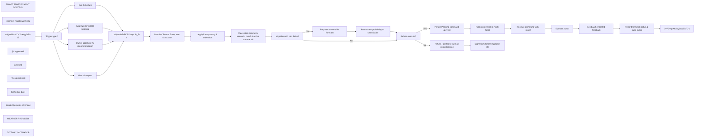

# CF3 - Smart Environment Control

Source: `SmartFarm_Activity_Swimlane_Diagram.drawio`.

```mermaid
flowchart LR
  cf3_title["SMART ENVIRONMENT CONTROL"]
  cf3_l1["OWNER / AUTOMATION"]
  cf3_t1["Manual request"]
  cf3_t2["Due Schedule"]
  cf3_t3["AutoRule threshold matched"]
  cf3_t4["Owner-approved AI recommendation"]
  uJgVebDhXCN7nXQgfa5d_16["uJgVebDhXCN7nXQgfa5d-16"]
  uJgVebDhXCN7nXQgfa5d_34["[AI approved]"]
  uJgVebDhXCN7nXQgfa5d_35["[Manual]"]
  uJgVebDhXCN7nXQgfa5d_36["[Threshold met]"]
  uJgVebDhXCN7nXQgfa5d_37["[Schedule due]"]
  uJgVebDhXCN7nXQgfa5d_28["Trigger type?"]
  UdqMmth7sPKRVMepUP_F_2["UdqMmth7sPKRVMepUP_F-2"]
  cf3_l2["SMARTFARM PLATFORM"]
  cf3_p1["Resolve Tenant, Zone, role & actuator"]
  cf3_p2["Apply idempotency & arbitration"]
  cf3_p3["Check stale telemetry, interlock, cutoff & active commands"]
  cf3_d1["Irrigation with rain delay?"]
  cf3_p4["Request server-side forecast"]
  cf3_d2["Safe to execute?"]
  cf3_p5["Refuse / postpone with an explicit reason"]
  cf3_p6["Persist Pending command & event"]
  cf3_p7["Publish downlink & mark Sent"]
  cf3_p8["Record terminal status & audit event"]
  uJgVebDhXCN7nXQgfa5d_38["uJgVebDhXCN7nXQgfa5d-38"]
  n_3vPCvqoXC2ky3sWiDoTj_1["3vPCvqoXC2ky3sWiDoTj-1"]
  cf3_l3["WEATHER PROVIDER"]
  cf3_w1["Return rain probability or unavailable"]
  cf3_l4["GATEWAY / ACTUATOR"]
  cf3_dv1["Receive command with cutoff"]
  cf3_dv2["Operate pump"]
  cf3_dv3["Send authenticated feedback"]
  cf3_t2 --> UdqMmth7sPKRVMepUP_F_2
  cf3_t3 --> UdqMmth7sPKRVMepUP_F_2
  uJgVebDhXCN7nXQgfa5d_16 --> uJgVebDhXCN7nXQgfa5d_28
  uJgVebDhXCN7nXQgfa5d_28 --> cf3_t4
  uJgVebDhXCN7nXQgfa5d_28 --> cf3_t1
  uJgVebDhXCN7nXQgfa5d_28 --> cf3_t3
  uJgVebDhXCN7nXQgfa5d_28 --> cf3_t2
  cf3_t4 --> UdqMmth7sPKRVMepUP_F_2
  cf3_t1 --> UdqMmth7sPKRVMepUP_F_2
  cf3_p5 --> uJgVebDhXCN7nXQgfa5d_38
  cf3_p8 --> n_3vPCvqoXC2ky3sWiDoTj_1
  cf3_p1 --> cf3_p2
  cf3_p2 --> cf3_p3
  cf3_p3 --> cf3_d1
  cf3_d1 --> |Yes| cf3_p4
  cf3_p4 --> cf3_w1
  cf3_w1 --> cf3_d2
  cf3_d1 --> |No| cf3_d2
  cf3_d2 --> |No| cf3_p5
  cf3_d2 --> |Yes| cf3_p6
  cf3_p6 --> cf3_p7
  cf3_p7 --> cf3_dv1
  cf3_dv1 --> cf3_dv2
  cf3_dv2 --> cf3_dv3
  cf3_dv3 --> cf3_p8
  UdqMmth7sPKRVMepUP_F_2 --> cf3_p1
```
