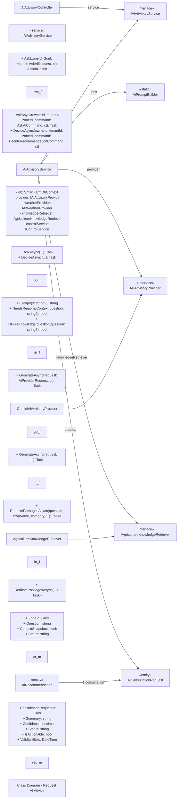

# Class Diagram - Request AI Advice

Source: `SmartFarm_R4_Class_AiAdvisory.drawio`.

```mermaid
flowchart LR
  ctl["AiAdvisoryController"]
  ctl_f["- service: IAiAdvisoryService"]
  ctl_m["+ Ask(zoneId: Guid, request: AskAiRequest, ct): ActionResult"]
  isvc["«interface»<br/>IAiAdvisoryService"]
  isvc_f["isvc_f"]
  isvc_m["+ AskAsync(ownerId, tenantId, zoneId, command: AskAiCommand, ct): Task<br/>+ DecideAsync(ownerId, tenantId, zoneId, command: DecideRecommendationCommand, ct)"]
  svc["AiAdvisoryService"]
  svc_f["- db: SmartFarmDbContext<br/>- provider: IAiAdvisoryProvider<br/>- weatherProvider: IAiWeatherProvider<br/>- knowledgeRetriever: IAgricultureKnowledgeRetriever<br/>- controlService: IControlService"]
  svc_m["+ AskAsync(...): Task<br/>+ DecideAsync(...): Task"]
  pb["«static»<br/>AiPromptBuilder"]
  pb_f["pb_f"]
  pb_m["+ Escape(s: string?): string<br/>+ NeedsRegionalContext(question: string?): bool<br/>+ IsPureKnowledgeQuestion(question: string?): bool"]
  ip["«interface»<br/>IAiAdvisoryProvider"]
  ip_f["ip_f"]
  ip_m["+ GenerateAsync(request: AiProviderRequest, ct): Task"]
  gp["GeminiAiAdvisoryProvider"]
  gp_f["gp_f"]
  gp_m["+ GenerateAsync(request, ct): Task"]
  ir["«interface»<br/>IAgricultureKnowledgeRetriever"]
  ir_f["ir_f"]
  ir_m["+ RetrievePassagesAsync(question, cropName, category, ...): Task>"]
  kr["AgricultureKnowledgeRetriever"]
  kr_f["kr_f"]
  kr_m["+ RetrievePassagesAsync(...): Task>"]
  cr["«entity»<br/>AiConsultationRequest"]
  cr_f["+ ZoneId: Guid<br/>+ Question: string<br/>+ ContextSnapshot: jsonb<br/>+ Status: string"]
  cr_m["cr_m"]
  rec["«entity»<br/>AiRecommendation"]
  rec_f["+ ConsultationRequestId: Guid<br/>+ Summary: string<br/>+ Confidence: decimal<br/>+ Status: string<br/>+ IsActionable: bool<br/>+ ValidUntilUtc: DateTime"]
  rec_m["rec_m"]
  title["Class Diagram - Request AI Advice"]
  ctl --> |service| isvc
  svc --> isvc
  svc --> |uses| pb
  svc --> |provider| ip
  gp --> ip
  svc --> |knowledgeRetriever| ir
  kr --> ir
  svc --> |creates| cr
  rec --> |1 consultation| cr
```
