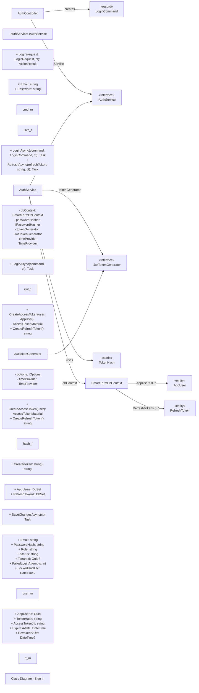

# Class Diagram - Sign in

Source: `SmartFarm_R4_Class_Auth.drawio`.

```mermaid
flowchart LR
  ctl["AuthController"]
  ctl_f["- authService: IAuthService"]
  ctl_m["+ Login(request: LoginRequest, ct): ActionResult"]
  cmd["«record»<br/>LoginCommand"]
  cmd_f["+ Email: string<br/>+ Password: string"]
  cmd_m["cmd_m"]
  isvc["«interface»<br/>IAuthService"]
  isvc_f["isvc_f"]
  isvc_m["+ LoginAsync(command: LoginCommand, ct): Task<br/>+ RefreshAsync(refreshToken: string, ct): Task"]
  svc["AuthService"]
  svc_f["- dbContext: SmartFarmDbContext<br/>- passwordHasher: IPasswordHasher<br/>- tokenGenerator: IJwtTokenGenerator<br/>- timeProvider: TimeProvider"]
  svc_m["+ LoginAsync(command, ct): Task"]
  ijwt["«interface»<br/>IJwtTokenGenerator"]
  ijwt_f["ijwt_f"]
  ijwt_m["+ CreateAccessToken(user: AppUser): AccessTokenMaterial<br/>+ CreateRefreshToken(): string"]
  jwt["JwtTokenGenerator"]
  jwt_f["- options: IOptions<br/>- timeProvider: TimeProvider"]
  jwt_m["+ CreateAccessToken(user): AccessTokenMaterial<br/>+ CreateRefreshToken(): string"]
  hash["«static»<br/>TokenHash"]
  hash_f["hash_f"]
  hash_m["+ Create(token: string): string"]
  db["SmartFarmDbContext"]
  db_f["+ AppUsers: DbSet<br/>+ RefreshTokens: DbSet"]
  db_m["+ SaveChangesAsync(ct): Task"]
  user["«entity»<br/>AppUser"]
  user_f["+ Email: string<br/>+ PasswordHash: string<br/>+ Role: string<br/>+ Status: string<br/>+ TenantId: Guid?<br/>+ FailedLoginAttempts: int<br/>+ LockedUntilUtc: DateTime?"]
  user_m["user_m"]
  rt["«entity»<br/>RefreshToken"]
  rt_f["+ AppUserId: Guid<br/>+ TokenHash: string<br/>+ AccessTokenJti: string<br/>+ ExpiresAtUtc: DateTime<br/>+ RevokedAtUtc: DateTime?"]
  rt_m["rt_m"]
  title["Class Diagram - Sign in"]
  ctl --> |authService| isvc
  ctl --> |creates| cmd
  svc --> isvc
  svc --> |tokenGenerator| ijwt
  jwt --> ijwt
  svc --> |dbContext| db
  svc --> |uses| hash
  db --> |AppUsers 0..*| user
  db --> |RefreshTokens 0..*| rt
```
