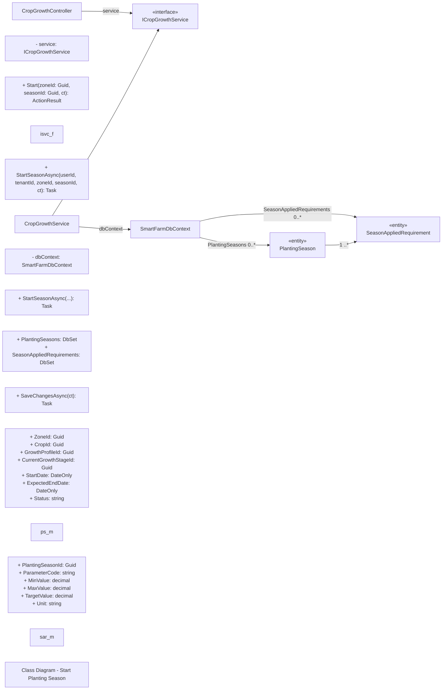

# Class Diagram - Start Planting Season

Source: `SmartFarm_R4_Class_CropGrowth.drawio`.

```mermaid
flowchart LR
  ctl["CropGrowthController"]
  ctl_f["- service: ICropGrowthService"]
  ctl_m["+ Start(zoneId: Guid, seasonId: Guid, ct): ActionResult"]
  isvc["«interface»<br/>ICropGrowthService"]
  isvc_f["isvc_f"]
  isvc_m["+ StartSeasonAsync(userId, tenantId, zoneId, seasonId, ct): Task"]
  svc["CropGrowthService"]
  svc_f["- dbContext: SmartFarmDbContext"]
  svc_m["+ StartSeasonAsync(...): Task"]
  db["SmartFarmDbContext"]
  db_f["+ PlantingSeasons: DbSet<br/>+ SeasonAppliedRequirements: DbSet"]
  db_m["+ SaveChangesAsync(ct): Task"]
  ps["«entity»<br/>PlantingSeason"]
  ps_f["+ ZoneId: Guid<br/>+ CropId: Guid<br/>+ GrowthProfileId: Guid<br/>+ CurrentGrowthStageId: Guid<br/>+ StartDate: DateOnly<br/>+ ExpectedEndDate: DateOnly<br/>+ Status: string"]
  ps_m["ps_m"]
  sar["«entity»<br/>SeasonAppliedRequirement"]
  sar_f["+ PlantingSeasonId: Guid<br/>+ ParameterCode: string<br/>+ MinValue: decimal<br/>+ MaxValue: decimal<br/>+ TargetValue: decimal<br/>+ Unit: string"]
  sar_m["sar_m"]
  title["Class Diagram - Start Planting Season"]
  ctl --> |service| isvc
  svc --> isvc
  svc --> |dbContext| db
  db --> |PlantingSeasons 0..*| ps
  db --> |SeasonAppliedRequirements 0..*| sar
  ps --> |1 ..*| sar
```
