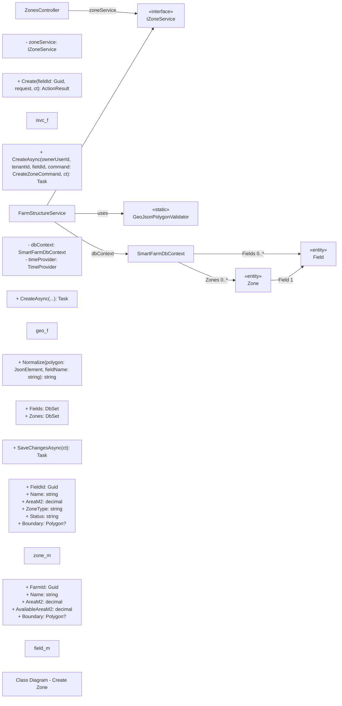

# Class Diagram - Create Zone

Source: `SmartFarm_R4_Class_FarmStructure.drawio`.

```mermaid
flowchart LR
  ctl["ZonesController"]
  ctl_f["- zoneService: IZoneService"]
  ctl_m["+ Create(fieldId: Guid, request, ct): ActionResult"]
  isvc["«interface»<br/>IZoneService"]
  isvc_f["isvc_f"]
  isvc_m["+ CreateAsync(ownerUserId, tenantId, fieldId, command: CreateZoneCommand, ct): Task"]
  svc["FarmStructureService"]
  svc_f["- dbContext: SmartFarmDbContext<br/>- timeProvider: TimeProvider"]
  svc_m["+ CreateAsync(...): Task"]
  geo["«static»<br/>GeoJsonPolygonValidator"]
  geo_f["geo_f"]
  geo_m["+ Normalize(polygon: JsonElement, fieldName: string): string"]
  db["SmartFarmDbContext"]
  db_f["+ Fields: DbSet<br/>+ Zones: DbSet"]
  db_m["+ SaveChangesAsync(ct): Task"]
  zone["«entity»<br/>Zone"]
  zone_f["+ FieldId: Guid<br/>+ Name: string<br/>+ AreaM2: decimal<br/>+ ZoneType: string<br/>+ Status: string<br/>+ Boundary: Polygon?"]
  zone_m["zone_m"]
  field["«entity»<br/>Field"]
  field_f["+ FarmId: Guid<br/>+ Name: string<br/>+ AreaM2: decimal<br/>+ AvailableAreaM2: decimal<br/>+ Boundary: Polygon?"]
  field_m["field_m"]
  title["Class Diagram - Create Zone"]
  ctl --> |zoneService| isvc
  svc --> isvc
  svc --> |uses| geo
  svc --> |dbContext| db
  db --> |Zones 0..*| zone
  db --> |Fields 0..*| field
  zone --> |Field 1| field
```
