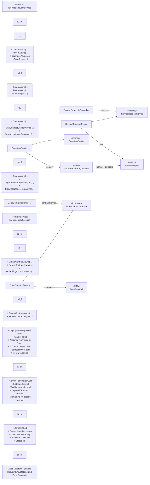

# Class Diagram - Service Requests, Quotations and Zone Contracts

Source: `SmartFarm_R4_Class_FinanceService.drawio`.

```mermaid
flowchart LR
  c1["ServiceRequestsController"]
  c1_f["- service: IServiceRequestService"]
  c1_m["c1_m"]
  i1["«interface»<br/>IServiceRequestService"]
  i1_f["i1_f"]
  i1_m["+ CreateAsync(...)<br/>+ AcceptAsync(...)<br/>+ DiagnoseAsync(...)<br/>+ CloseAsync(...)"]
  s1["ServiceRequestService"]
  s1_f["s1_f"]
  s1_m["+ CreateAsync(...)<br/>+ AcceptAsync(...)<br/>+ CloseAsync(...)"]
  iq["«interface»<br/>IQuotationService"]
  iq_f["iq_f"]
  iq_m["+ CreateAsync(...)<br/>+ SignContractDepositAsync(...)<br/>+ SignAcceptanceFinalAsync(...)"]
  sq["QuotationService"]
  sq_f["sq_f"]
  sq_m["+ CreateAsync(...)<br/>+ SignContractDepositAsync(...)<br/>+ SignAcceptanceFinalAsync(...)"]
  c2["ZoneContractsController"]
  c2_f["- contractService: IZoneContractService"]
  c2_m["c2_m"]
  i2["«interface»<br/>IZoneContractService"]
  i2_f["i2_f"]
  i2_m["+ CreateContractAsync(...)<br/>+ RenewContractAsync(...)<br/>+ GetExpiringContractsAsync(...)"]
  s2["ZoneContractService"]
  s2_f["s2_f"]
  s2_m["+ CreateContractAsync(...)<br/>+ RenewContractAsync(...)"]
  sr["«entity»<br/>ServiceRequest"]
  sr_f["+ DeploymentRequestId: Guid<br/>+ Status: string<br/>+ AssignedTechnicianId: Guid?<br/>+ IsContractSigned: bool<br/>+ IsDepositPaid: bool<br/>+ IsFullyPaid: bool"]
  sr_m["sr_m"]
  qu["«entity»<br/>ServiceRequestQuotation"]
  qu_f["+ ServiceRequestId: Guid<br/>+ Subtotal: decimal<br/>+ TotalAmount: decimal<br/>+ Deposit30Percent: decimal<br/>+ Remaining70Percent: decimal"]
  qu_m["qu_m"]
  zc["«entity»<br/>ZoneContract"]
  zc_f["+ ZoneId: Guid<br/>+ ContractNumber: string<br/>+ StartDate: DateOnly<br/>+ EndDate: DateOnly<br/>+ Status: int"]
  zc_m["zc_m"]
  title["Class Diagram - Service Requests, Quotations and Zone Contracts"]
  c1 --> |service| i1
  c2 --> |contractService| i2
  s1 --> i1
  s2 --> i2
  sq --> iq
  s1 --> |uses| sr
  sq --> |creates| qu
  s2 --> |creates| zc
  qu --> |ServiceRequest 1| sr
```
