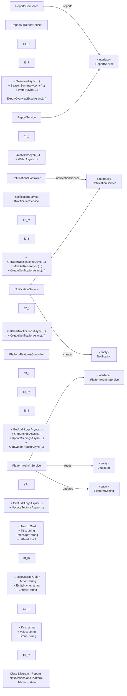

# Class Diagram - Reports, Notifications and Platform Administration

Source: `SmartFarm_R4_Class_Reports.drawio`.

```mermaid
flowchart LR
  c1["ReportsController"]
  c1_f["- reports: IReportService"]
  c1_m["c1_m"]
  i1["«interface»<br/>IReportService"]
  i1_f["i1_f"]
  i1_m["+ OverviewAsync(...)<br/>+ SeasonSummaryAsync(...)<br/>+ WaterAsync(...)<br/>+ ExportOverviewExcelAsync(...)"]
  s1["ReportService"]
  s1_f["s1_f"]
  s1_m["+ OverviewAsync(...)<br/>+ WaterAsync(...)"]
  c2["NotificationsController"]
  c2_f["- notificationService: INotificationService"]
  c2_m["c2_m"]
  i2["«interface»<br/>INotificationService"]
  i2_f["i2_f"]
  i2_m["+ GetUserNotificationsAsync(...)<br/>+ MarkAsReadAsync(...)<br/>+ CreateNotificationAsync(...)"]
  s2["NotificationService"]
  s2_f["s2_f"]
  s2_m["+ GetUserNotificationsAsync(...)<br/>+ CreateNotificationAsync(...)"]
  c3["PlatformFeaturesController"]
  c3_f["c3_f"]
  c3_m["c3_m"]
  i3["«interface»<br/>IPlatformAdminService"]
  i3_f["i3_f"]
  i3_m["+ GetAuditLogsAsync(...)<br/>+ GetSettingsAsync(...)<br/>+ UpdateSettingsAsync(...)<br/>+ GetSystemHealthAsync(...)"]
  s3["PlatformAdminService"]
  s3_f["s3_f"]
  s3_m["+ GetAuditLogsAsync(...)<br/>+ UpdateSettingsAsync(...)"]
  nt["«entity»<br/>Notification"]
  nt_f["+ UserId: Guid<br/>+ Title: string<br/>+ Message: string<br/>+ IsRead: bool"]
  nt_m["nt_m"]
  au["«entity»<br/>AuditLog"]
  au_f["+ ActorUserId: Guid?<br/>+ Action: string<br/>+ EntityName: string<br/>+ EntityId: string"]
  au_m["au_m"]
  ps["«entity»<br/>PlatformSetting"]
  ps_f["+ Key: string<br/>+ Value: string<br/>+ Group: string"]
  ps_m["ps_m"]
  title["Class Diagram - Reports, Notifications and Platform Administration"]
  c1 --> |reports| i1
  c2 --> |notificationService| i2
  s1 --> i1
  s2 --> i2
  s3 --> i3
  s2 --> |creates| nt
  s3 --> |reads| au
  s3 --> |updates| ps
```
