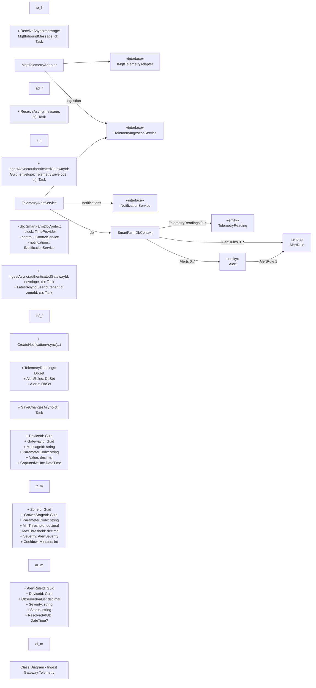

# Class Diagram - Ingest Gateway Telemetry

Source: `SmartFarm_R4_Class_Telemetry.drawio`.

```mermaid
flowchart LR
  ia["«interface»<br/>IMqttTelemetryAdapter"]
  ia_f["ia_f"]
  ia_m["+ ReceiveAsync(message: MqttInboundMessage, ct): Task"]
  ad["MqttTelemetryAdapter"]
  ad_f["ad_f"]
  ad_m["+ ReceiveAsync(message, ct): Task"]
  ii["«interface»<br/>ITelemetryIngestionService"]
  ii_f["ii_f"]
  ii_m["+ IngestAsync(authenticatedGatewayId: Guid, envelope: TelemetryEnvelope, ct): Task"]
  svc["TelemetryAlertService"]
  svc_f["- db: SmartFarmDbContext<br/>- clock: TimeProvider<br/>- control: IControlService<br/>- notifications: INotificationService"]
  svc_m["+ IngestAsync(authenticatedGatewayId, envelope, ct): Task<br/>+ LatestAsync(userId, tenantId, zoneId, ct): Task"]
  inf["«interface»<br/>INotificationService"]
  inf_f["inf_f"]
  inf_m["+ CreateNotificationAsync(...)"]
  db["SmartFarmDbContext"]
  db_f["+ TelemetryReadings: DbSet<br/>+ AlertRules: DbSet<br/>+ Alerts: DbSet"]
  db_m["+ SaveChangesAsync(ct): Task"]
  tr["«entity»<br/>TelemetryReading"]
  tr_f["+ DeviceId: Guid<br/>+ GatewayId: Guid<br/>+ MessageId: string<br/>+ ParameterCode: string<br/>+ Value: decimal<br/>+ CapturedAtUtc: DateTime"]
  tr_m["tr_m"]
  ar["«entity»<br/>AlertRule"]
  ar_f["+ ZoneId: Guid<br/>+ GrowthStageId: Guid<br/>+ ParameterCode: string<br/>+ MinThreshold: decimal<br/>+ MaxThreshold: decimal<br/>+ Severity: AlertSeverity<br/>+ CooldownMinutes: int"]
  ar_m["ar_m"]
  al["«entity»<br/>Alert"]
  al_f["+ AlertRuleId: Guid<br/>+ DeviceId: Guid<br/>+ ObservedValue: decimal<br/>+ Severity: string<br/>+ Status: string<br/>+ ResolvedAtUtc: DateTime?"]
  al_m["al_m"]
  title["Class Diagram - Ingest Gateway Telemetry"]
  ad --> ia
  ad --> |ingestion| ii
  svc --> ii
  svc --> |notifications| inf
  svc --> |db| db
  db --> |TelemetryReadings 0..*| tr
  db --> |AlertRules 0..*| ar
  db --> |Alerts 0..*| al
  al --> |AlertRule 1| ar
```
