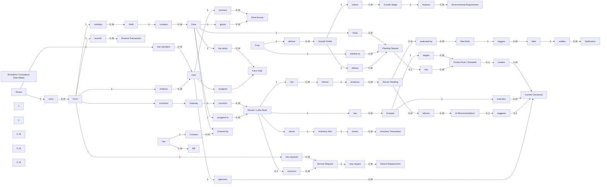

# SmartFarm Conceptual ERD

Source: `SmartFarm_Conceptual_ERD_Diagram.drawio`.

```mermaid
flowchart LR
  clVBI_ogpkGd_3QIyBPq_3["Smartfarm Conceptual Data Model"]
  clVBI_ogpkGd_3QIyBPq_4["Tenant"]
  clVBI_ogpkGd_3QIyBPq_6["1"]
  clVBI_ogpkGd_3QIyBPq_7["User"]
  clVBI_ogpkGd_3QIyBPq_9["1"]
  clVBI_ogpkGd_3QIyBPq_10["Farm"]
  clVBI_ogpkGd_3QIyBPq_11["Field"]
  clVBI_ogpkGd_3QIyBPq_13["Zone"]
  clVBI_ogpkGd_3QIyBPq_14["Zone Access"]
  clVBI_ogpkGd_3QIyBPq_15["Crop"]
  clVBI_ogpkGd_3QIyBPq_16["Growth Profile"]
  clVBI_ogpkGd_3QIyBPq_17["Growth Stage"]
  clVBI_ogpkGd_3QIyBPq_18["Environmental Requirement"]
  clVBI_ogpkGd_3QIyBPq_20["Planting Season"]
  clVBI_ogpkGd_3QIyBPq_21["Gateway"]
  clVBI_ogpkGd_3QIyBPq_23["0..M"]
  clVBI_ogpkGd_3QIyBPq_24["Device / LoRa Node"]
  clVBI_ogpkGd_3QIyBPq_25["Sensor"]
  clVBI_ogpkGd_3QIyBPq_26["Sensor Reading"]
  clVBI_ogpkGd_3QIyBPq_27["Alert Rule"]
  clVBI_ogpkGd_3QIyBPq_28["Alert"]
  clVBI_ogpkGd_3QIyBPq_29["Notification"]
  clVBI_ogpkGd_3QIyBPq_30["Actuator"]
  clVBI_ogpkGd_3QIyBPq_31["Control Rule / Schedule"]
  clVBI_ogpkGd_3QIyBPq_32["Control Command"]
  clVBI_ogpkGd_3QIyBPq_33["AI Recommendation"]
  clVBI_ogpkGd_3QIyBPq_34["Farm Task"]
  clVBI_ogpkGd_3QIyBPq_35["Inventory Item"]
  clVBI_ogpkGd_3QIyBPq_36["Inventory Transaction"]
  clVBI_ogpkGd_3QIyBPq_37["Finance Transaction"]
  clVBI_ogpkGd_3QIyBPq_38["Service Request"]
  clVBI_ogpkGd_3QIyBPq_39["Device Replacement"]
  clVBI_ogpkGd_3QIyBPq_40["has members"]
  clVBI_ogpkGd_3QIyBPq_43["owns"]
  clVBI_ogpkGd_3QIyBPq_46["employs"]
  clVBI_ogpkGd_3QIyBPq_49["contains"]
  clVBI_ogpkGd_3QIyBPq_52["contains"]
  clVBI_ogpkGd_3QIyBPq_55["receives"]
  clVBI_ogpkGd_3QIyBPq_58["grants"]
  clVBI_ogpkGd_3QIyBPq_61["defines"]
  clVBI_ogpkGd_3QIyBPq_64["orders"]
  clVBI_ogpkGd_3QIyBPq_67["requires"]
  clVBI_ogpkGd_3QIyBPq_70["hosts"]
  clVBI_ogpkGd_3QIyBPq_73["planted as"]
  clVBI_ogpkGd_3QIyBPq_76["follows"]
  clVBI_ogpkGd_3QIyBPq_79["connects"]
  clVBI_ogpkGd_3QIyBPq_82["assigned to"]
  clVBI_ogpkGd_3QIyBPq_85["has"]
  clVBI_ogpkGd_3QIyBPq_88["has"]
  clVBI_ogpkGd_3QIyBPq_91["produces"]
  clVBI_ogpkGd_3QIyBPq_94["evaluated by"]
  clVBI_ogpkGd_3QIyBPq_97["triggers"]
  clVBI_ogpkGd_3QIyBPq_100["notifies"]
  clVBI_ogpkGd_3QIyBPq_103["targets"]
  clVBI_ogpkGd_3QIyBPq_106["creates"]
  clVBI_ogpkGd_3QIyBPq_109["executes"]
  clVBI_ogpkGd_3QIyBPq_112["informs"]
  clVBI_ogpkGd_3QIyBPq_115["suggests"]
  clVBI_ogpkGd_3QIyBPq_118["approves"]
  clVBI_ogpkGd_3QIyBPq_121["has tasks"]
  clVBI_ogpkGd_3QIyBPq_124["stocks"]
  clVBI_ogpkGd_3QIyBPq_126["moves"]
  clVBI_ogpkGd_3QIyBPq_129["records"]
  clVBI_ogpkGd_3QIyBPq_132["has requests"]
  clVBI_ogpkGd_3QIyBPq_135["concerns"]
  clVBI_ogpkGd_3QIyBPq_138["may require"]
  clVBI_ogpkGd_3QIyBPq_142["0..M"]
  clVBI_ogpkGd_3QIyBPq_143["conntains"]
  clVBI_ogpkGd_3QIyBPq_145["0..M"]
  clVBI_ogpkGd_3QIyBPq_146["assigned"]
  clVBI_ogpkGd_3QIyBPq_148["has"]
  clVBI_ogpkGd_3QIyBPq_150["Contract"]
  clVBI_ogpkGd_3QIyBPq_151["Covered by"]
  clVBI_ogpkGd_3QIyBPq_152["Bill"]
  clVBI_ogpkGd_3QIyBPq_154["has"]
  clVBI_ogpkGd_3QIyBPq_7 --> clVBI_ogpkGd_3QIyBPq_146
  clVBI_ogpkGd_3QIyBPq_10 --> clVBI_ogpkGd_3QIyBPq_143
  clVBI_ogpkGd_3QIyBPq_13 --> |1| clVBI_ogpkGd_3QIyBPq_151
  clVBI_ogpkGd_3QIyBPq_20 --> |0..1| clVBI_ogpkGd_3QIyBPq_148
  clVBI_ogpkGd_3QIyBPq_24 --> clVBI_ogpkGd_3QIyBPq_124
  clVBI_ogpkGd_3QIyBPq_4 --> |1| clVBI_ogpkGd_3QIyBPq_40
  clVBI_ogpkGd_3QIyBPq_40 --> |0..M| clVBI_ogpkGd_3QIyBPq_7
  clVBI_ogpkGd_3QIyBPq_4 --> |1| clVBI_ogpkGd_3QIyBPq_43
  clVBI_ogpkGd_3QIyBPq_43 --> |0..M| clVBI_ogpkGd_3QIyBPq_10
  clVBI_ogpkGd_3QIyBPq_10 --> |1| clVBI_ogpkGd_3QIyBPq_46
  clVBI_ogpkGd_3QIyBPq_46 --> |0..M| clVBI_ogpkGd_3QIyBPq_7
  clVBI_ogpkGd_3QIyBPq_10 --> |1| clVBI_ogpkGd_3QIyBPq_49
  clVBI_ogpkGd_3QIyBPq_49 --> |0..M| clVBI_ogpkGd_3QIyBPq_11
  clVBI_ogpkGd_3QIyBPq_11 --> |1| clVBI_ogpkGd_3QIyBPq_52
  clVBI_ogpkGd_3QIyBPq_52 --> |0..M| clVBI_ogpkGd_3QIyBPq_13
  clVBI_ogpkGd_3QIyBPq_7 --> |1| clVBI_ogpkGd_3QIyBPq_55
  clVBI_ogpkGd_3QIyBPq_55 --> |0..M| clVBI_ogpkGd_3QIyBPq_14
  clVBI_ogpkGd_3QIyBPq_13 --> |1| clVBI_ogpkGd_3QIyBPq_58
  clVBI_ogpkGd_3QIyBPq_58 --> |0..M| clVBI_ogpkGd_3QIyBPq_14
  clVBI_ogpkGd_3QIyBPq_15 --> |1| clVBI_ogpkGd_3QIyBPq_61
  clVBI_ogpkGd_3QIyBPq_61 --> |0..M| clVBI_ogpkGd_3QIyBPq_16
  clVBI_ogpkGd_3QIyBPq_16 --> |1| clVBI_ogpkGd_3QIyBPq_64
  clVBI_ogpkGd_3QIyBPq_64 --> |1..M| clVBI_ogpkGd_3QIyBPq_17
  clVBI_ogpkGd_3QIyBPq_17 --> |1| clVBI_ogpkGd_3QIyBPq_67
  clVBI_ogpkGd_3QIyBPq_67 --> |0..M| clVBI_ogpkGd_3QIyBPq_18
  clVBI_ogpkGd_3QIyBPq_13 --> |1| clVBI_ogpkGd_3QIyBPq_70
  clVBI_ogpkGd_3QIyBPq_70 --> |0..M| clVBI_ogpkGd_3QIyBPq_20
  clVBI_ogpkGd_3QIyBPq_15 --> |1| clVBI_ogpkGd_3QIyBPq_73
  clVBI_ogpkGd_3QIyBPq_73 --> |0..M| clVBI_ogpkGd_3QIyBPq_20
  clVBI_ogpkGd_3QIyBPq_16 --> |1| clVBI_ogpkGd_3QIyBPq_76
  clVBI_ogpkGd_3QIyBPq_76 --> |0..M| clVBI_ogpkGd_3QIyBPq_20
  clVBI_ogpkGd_3QIyBPq_21 --> |1| clVBI_ogpkGd_3QIyBPq_79
  clVBI_ogpkGd_3QIyBPq_79 --> |0..M| clVBI_ogpkGd_3QIyBPq_24
  clVBI_ogpkGd_3QIyBPq_13 --> |1| clVBI_ogpkGd_3QIyBPq_82
  clVBI_ogpkGd_3QIyBPq_82 --> |0..M| clVBI_ogpkGd_3QIyBPq_24
  clVBI_ogpkGd_3QIyBPq_24 --> |1| clVBI_ogpkGd_3QIyBPq_85
  clVBI_ogpkGd_3QIyBPq_85 --> |0..M| clVBI_ogpkGd_3QIyBPq_25
  clVBI_ogpkGd_3QIyBPq_24 --> |1| clVBI_ogpkGd_3QIyBPq_88
  clVBI_ogpkGd_3QIyBPq_88 --> |0..M| clVBI_ogpkGd_3QIyBPq_30
  clVBI_ogpkGd_3QIyBPq_25 --> |1| clVBI_ogpkGd_3QIyBPq_91
  clVBI_ogpkGd_3QIyBPq_91 --> |0..M| clVBI_ogpkGd_3QIyBPq_26
  clVBI_ogpkGd_3QIyBPq_26 --> |0..M| clVBI_ogpkGd_3QIyBPq_94
  clVBI_ogpkGd_3QIyBPq_94 --> |0..M| clVBI_ogpkGd_3QIyBPq_27
  clVBI_ogpkGd_3QIyBPq_27 --> |1| clVBI_ogpkGd_3QIyBPq_97
  clVBI_ogpkGd_3QIyBPq_97 --> |0..M| clVBI_ogpkGd_3QIyBPq_28
  clVBI_ogpkGd_3QIyBPq_28 --> |1| clVBI_ogpkGd_3QIyBPq_100
  clVBI_ogpkGd_3QIyBPq_100 --> |0..M| clVBI_ogpkGd_3QIyBPq_29
  clVBI_ogpkGd_3QIyBPq_30 --> |1| clVBI_ogpkGd_3QIyBPq_103
  clVBI_ogpkGd_3QIyBPq_103 --> |0..M| clVBI_ogpkGd_3QIyBPq_31
  clVBI_ogpkGd_3QIyBPq_31 --> |0..1| clVBI_ogpkGd_3QIyBPq_106
  clVBI_ogpkGd_3QIyBPq_106 --> |0..M| clVBI_ogpkGd_3QIyBPq_32
  clVBI_ogpkGd_3QIyBPq_30 --> |1| clVBI_ogpkGd_3QIyBPq_109
  clVBI_ogpkGd_3QIyBPq_109 --> |0..M| clVBI_ogpkGd_3QIyBPq_32
  clVBI_ogpkGd_3QIyBPq_26 --> |0..M| clVBI_ogpkGd_3QIyBPq_112
  clVBI_ogpkGd_3QIyBPq_112 --> |0..M| clVBI_ogpkGd_3QIyBPq_33
  clVBI_ogpkGd_3QIyBPq_33 --> |0..1| clVBI_ogpkGd_3QIyBPq_115
  clVBI_ogpkGd_3QIyBPq_115 --> |0..1| clVBI_ogpkGd_3QIyBPq_32
  clVBI_ogpkGd_3QIyBPq_7 --> |1| clVBI_ogpkGd_3QIyBPq_118
  clVBI_ogpkGd_3QIyBPq_118 --> |0..M| clVBI_ogpkGd_3QIyBPq_32
  clVBI_ogpkGd_3QIyBPq_13 --> |1| clVBI_ogpkGd_3QIyBPq_121
  clVBI_ogpkGd_3QIyBPq_121 --> |0..M| clVBI_ogpkGd_3QIyBPq_34
  clVBI_ogpkGd_3QIyBPq_124 --> |1| clVBI_ogpkGd_3QIyBPq_35
  clVBI_ogpkGd_3QIyBPq_35 --> |1| clVBI_ogpkGd_3QIyBPq_126
  clVBI_ogpkGd_3QIyBPq_126 --> |0..M| clVBI_ogpkGd_3QIyBPq_36
  clVBI_ogpkGd_3QIyBPq_10 --> |1| clVBI_ogpkGd_3QIyBPq_129
  clVBI_ogpkGd_3QIyBPq_129 --> |0..M| clVBI_ogpkGd_3QIyBPq_37
  clVBI_ogpkGd_3QIyBPq_10 --> |1| clVBI_ogpkGd_3QIyBPq_132
  clVBI_ogpkGd_3QIyBPq_132 --> |0..M| clVBI_ogpkGd_3QIyBPq_38
  clVBI_ogpkGd_3QIyBPq_24 --> |0..1| clVBI_ogpkGd_3QIyBPq_135
  clVBI_ogpkGd_3QIyBPq_135 --> |0..M| clVBI_ogpkGd_3QIyBPq_38
  clVBI_ogpkGd_3QIyBPq_38 --> |1| clVBI_ogpkGd_3QIyBPq_138
  clVBI_ogpkGd_3QIyBPq_138 --> |0..M| clVBI_ogpkGd_3QIyBPq_39
  clVBI_ogpkGd_3QIyBPq_143 --> clVBI_ogpkGd_3QIyBPq_21
  clVBI_ogpkGd_3QIyBPq_146 --> clVBI_ogpkGd_3QIyBPq_34
  clVBI_ogpkGd_3QIyBPq_148 --> |0..M| clVBI_ogpkGd_3QIyBPq_31
  clVBI_ogpkGd_3QIyBPq_150 --> |0..M| clVBI_ogpkGd_3QIyBPq_151
  clVBI_ogpkGd_3QIyBPq_154 --> |1| clVBI_ogpkGd_3QIyBPq_150
  clVBI_ogpkGd_3QIyBPq_154 --> |1..M| clVBI_ogpkGd_3QIyBPq_152
```
