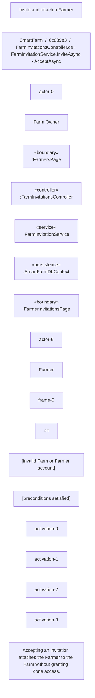

# Invite and attach a Farmer

Source: `SmartFarm_R4_Sequence_Diagrams_Part2.drawio`.

```mermaid
flowchart LR
  title["Invite and attach a Farmer"]
  source["SmartFarm  /  6c839e3  /  FarmInvitationsController.cs · FarmInvitationService.InviteAsync · AcceptAsync"]
  actor_0["actor-0"]
  actor_label_0["Farm Owner"]
  participant_1["«boundary»<br/>:FarmersPage"]
  participant_2["«controller»<br/>:FarmInvitationsController"]
  participant_3["«service»<br/>:FarmInvitationService"]
  participant_4["«persistence»<br/>:SmartFarmDbContext"]
  participant_5["«boundary»<br/>:FarmerInvitationsPage"]
  actor_6["actor-6"]
  actor_label_6["Farmer"]
  frame_0["frame-0"]
  tab_0["alt"]
  guard_0["[invalid Farm or Farmer account]"]
  otherwise_0["[preconditions satisfied]"]
  activation_0["activation-0"]
  activation_1["activation-1"]
  activation_2["activation-2"]
  activation_3["activation-3"]
  implementation_note["Accepting an invitation attaches the Farmer to the Farm without granting Zone access."]
```
