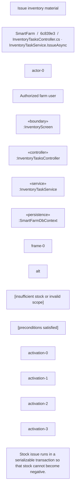

# Issue inventory material

Source: `SmartFarm_R4_Sequence_Diagrams_Part2.drawio`.

```mermaid
flowchart LR
  title["Issue inventory material"]
  source["SmartFarm  /  6c839e3  /  InventoryTasksController.cs · InventoryTaskService.IssueAsync"]
  actor_0["actor-0"]
  actor_label_0["Authorized farm user"]
  participant_1["«boundary»<br/>:InventoryScreen"]
  participant_2["«controller»<br/>:InventoryTasksController"]
  participant_3["«service»<br/>:InventoryTaskService"]
  participant_4["«persistence»<br/>:SmartFarmDbContext"]
  frame_0["frame-0"]
  tab_0["alt"]
  guard_0["[insufficient stock or invalid scope]"]
  otherwise_0["[preconditions satisfied]"]
  activation_0["activation-0"]
  activation_1["activation-1"]
  activation_2["activation-2"]
  activation_3["activation-3"]
  implementation_note["Stock issue runs in a serializable transaction so that stock cannot become negative."]
```
