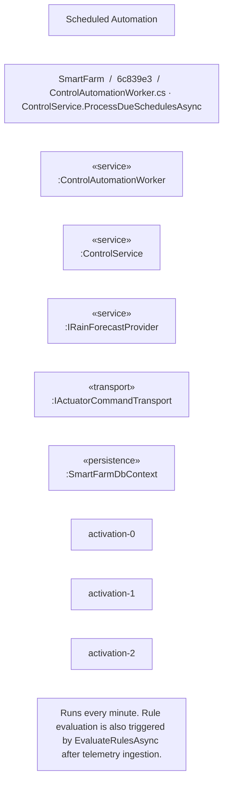

# Scheduled Automation

Source: `SmartFarm_R4_Sequence_Diagrams_Part2.drawio`.

```mermaid
flowchart LR
  title["Scheduled Automation"]
  source["SmartFarm  /  6c839e3  /  ControlAutomationWorker.cs · ControlService.ProcessDueSchedulesAsync"]
  participant_0["«service»<br/>:ControlAutomationWorker"]
  participant_1["«service»<br/>:ControlService"]
  participant_2["«service»<br/>:IRainForecastProvider"]
  participant_3["«transport»<br/>:IActuatorCommandTransport"]
  participant_4["«persistence»<br/>:SmartFarmDbContext"]
  activation_0["activation-0"]
  activation_1["activation-1"]
  activation_2["activation-2"]
  implementation_note["Runs every minute. Rule evaluation is also triggered by EvaluateRulesAsync after telemetry ingestion."]
```
