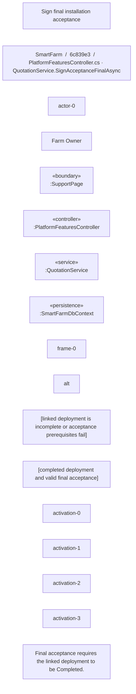

# Sign final installation acceptance

Source: `SmartFarm_R4_Sequence_Diagrams_Part2.drawio`.

```mermaid
flowchart LR
  title["Sign final installation acceptance"]
  source["SmartFarm  /  6c839e3  /  PlatformFeaturesController.cs · QuotationService.SignAcceptanceFinalAsync"]
  actor_0["actor-0"]
  actor_label_0["Farm Owner"]
  participant_1["«boundary»<br/>:SupportPage"]
  participant_2["«controller»<br/>:PlatformFeaturesController"]
  participant_3["«service»<br/>:QuotationService"]
  participant_4["«persistence»<br/>:SmartFarmDbContext"]
  frame_0["frame-0"]
  tab_0["alt"]
  guard_0["[linked deployment is incomplete or acceptance prerequisites fail]"]
  otherwise_0["[completed deployment and valid final acceptance]"]
  activation_0["activation-0"]
  activation_1["activation-1"]
  activation_2["activation-2"]
  activation_3["activation-3"]
  implementation_note["Final acceptance requires the linked deployment to be Completed."]
```
