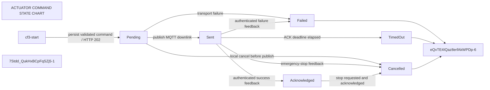

# CF3 - Actuator Command

Source: `SmartFarm_State_Chart_Diagram.drawio`.

```mermaid
flowchart LR
  cf3_title["ACTUATOR COMMAND STATE CHART"]
  cf3_start["cf3-start"]
  cf3_pending["Pending"]
  cf3_sent["Sent"]
  cf3_ack["Acknowledged"]
  cf3_failed["Failed"]
  cf3_timeout["TimedOut"]
  cf3_cancel["Cancelled"]
  eQvTE4IQaz8erfAkWPDp_6["eQvTE4IQaz8erfAkWPDp-6"]
  n_7Stdd_QukHxBCpFqSZj5_1["7Stdd_QukHxBCpFqSZj5-1"]
  cf3_start --> |persist validated command / HTTP 202| cf3_pending
  cf3_pending --> |publish MQTT downlink| cf3_sent
  cf3_pending --> |local cancel before publish| cf3_cancel
  cf3_pending --> |transport failure| cf3_failed
  cf3_sent --> |authenticated success feedback| cf3_ack
  cf3_sent --> |authenticated failure feedback| cf3_failed
  cf3_sent --> |ACK deadline elapsed| cf3_timeout
  cf3_sent --> |emergency-stop feedback| cf3_cancel
  cf3_ack --> |stop requested and acknowledged| cf3_cancel
  cf3_failed --> eQvTE4IQaz8erfAkWPDp_6
  cf3_timeout --> eQvTE4IQaz8erfAkWPDp_6
  cf3_cancel --> eQvTE4IQaz8erfAkWPDp_6
```
