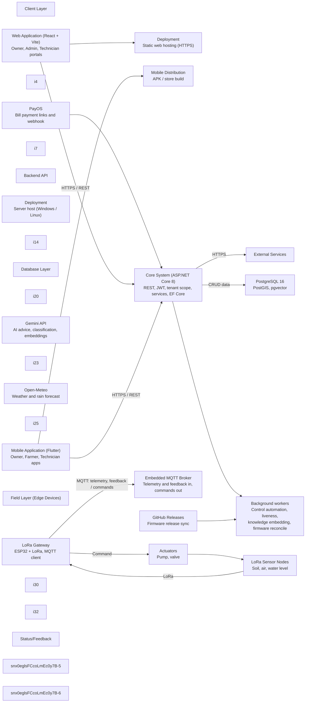

# Architecture

Source: `SmartFarm_System_Architecture_White.drawio`.

```mermaid
flowchart LR
  n2["Client Layer"]
  n3["Web Application (React + Vite)<br/>Owner, Admin, Technician portals"]
  i4["i4"]
  n5["Deployment<br/>Static web hosting (HTTPS)"]
  n6["Mobile Application (Flutter)<br/>Owner, Farmer, Technician apps"]
  i7["i7"]
  n8["Mobile Distribution<br/>APK / store build"]
  n11["Backend API"]
  n12["Deployment<br/>Server host (Windows / Linux)"]
  n13["Core System (ASP.NET Core 8)<br/>REST, JWT, tenant scope, services, EF Core"]
  i14["i14"]
  n15["Background workers<br/>Control automation, liveness,<br/>knowledge embedding, firmware reconcile"]
  n16["Embedded MQTT Broker<br/>Telemetry and feedback in, commands out"]
  n18["Database Layer"]
  n19["PostgreSQL 16<br/>PostGIS, pgvector"]
  i20["i20"]
  n21["External Services"]
  n22["Gemini API<br/>AI advice, classification, embeddings"]
  i23["i23"]
  n24["Open-Meteo<br/>Weather and rain forecast"]
  i25["i25"]
  n26["PayOS<br/>Bill payment links and webhook"]
  n27["GitHub Releases<br/>Firmware release sync"]
  n28["Field Layer (Edge Devices)"]
  n29["LoRa Gateway<br/>ESP32 + LoRa, MQTT client"]
  i30["i30"]
  n31["LoRa Sensor Nodes<br/>Soil, air, water level"]
  i32["i32"]
  snx0eglsFCcoLmEc0y7B_2["Status/Feedback"]
  n33["Actuators<br/>Pump, valve"]
  snx0eglsFCcoLmEc0y7B_5["snx0eglsFCcoLmEc0y7B-5"]
  snx0eglsFCcoLmEc0y7B_6["snx0eglsFCcoLmEc0y7B-6"]
  n3 --> n5
  n6 --> n8
  n13 --> n15
  n26 --> n13
  n27 --> n15
  n33 --> n31
  n31 --> |LoRa| n29
  n29 --> |Command| n33
  n3 --> |HTTPS / REST| n13
  n6 --> |HTTPS / REST| n13
  n13 --> |CRUD data| n19
  n13 --> |HTTPS| n21
  n29 --> |MQTT: telemetry, feedback / commands| n16
```
