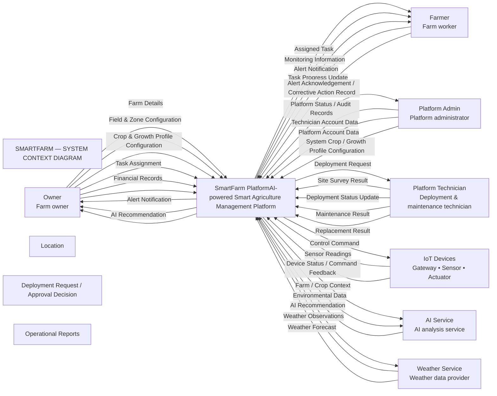

# System Context - Detailed Arrows

Source: `SmartFarm_System_Context_Diagram.drawio`.

```mermaid
flowchart LR
  n_74ef1a92_25f4_46f2_b717_aaaed7845a90["SMARTFARM — SYSTEM CONTEXT DIAGRAM"]
  e90dc636_02bc_461b_9b0f_aa1942e4b895["Owner<br/>Farm owner"]
  n_5b775acf_9718_46f9_af00_34bab492602c["Farmer<br/>Farm worker"]
  n_07aeacdb_b1db_4c57_9482_8243a2cfcfc8["Platform Admin<br/>Platform administrator"]
  n_36e51ee7_26a4_4f3b_ad0c_817cfd59a24c["Platform Technician<br/>Deployment & maintenance technician"]
  aff66259_2265_4126_ae2c_7d258f32f03f["IoT Devices<br/>Gateway • Sensor • Actuator"]
  n_90b3607e_f3bd_4644_9718_9fb8fef9502a["AI Service<br/>AI analysis service"]
  n_1325b745_ecdc_4f41_8582_33bbb3011103["Weather Service<br/>Weather data provider"]
  Wz5OoamZSoJxY_J70fkU_2["Location"]
  n_4YrzYoqWLO_W_Oc8TEvg_2["SmartFarm PlatformAI-powered Smart Agriculture Management Platform"]
  eDQKnsHkVf5fG4_CZ9Kc_2["Deployment Request / Approval Decision"]
  eDQKnsHkVf5fG4_CZ9Kc_4["Operational Reports"]
  e90dc636_02bc_461b_9b0f_aa1942e4b895 --> |Farm Details| n_4YrzYoqWLO_W_Oc8TEvg_2
  e90dc636_02bc_461b_9b0f_aa1942e4b895 --> |Field & Zone Configuration| n_4YrzYoqWLO_W_Oc8TEvg_2
  e90dc636_02bc_461b_9b0f_aa1942e4b895 --> |Crop & Growth Profile Configuration| n_4YrzYoqWLO_W_Oc8TEvg_2
  e90dc636_02bc_461b_9b0f_aa1942e4b895 --> |Task Assignment| n_4YrzYoqWLO_W_Oc8TEvg_2
  e90dc636_02bc_461b_9b0f_aa1942e4b895 --> |Financial Records| n_4YrzYoqWLO_W_Oc8TEvg_2
  n_4YrzYoqWLO_W_Oc8TEvg_2 --> |Alert Notification| e90dc636_02bc_461b_9b0f_aa1942e4b895
  n_4YrzYoqWLO_W_Oc8TEvg_2 --> |AI Recommendation| e90dc636_02bc_461b_9b0f_aa1942e4b895
  n_4YrzYoqWLO_W_Oc8TEvg_2 --> |Assigned Task| n_5b775acf_9718_46f9_af00_34bab492602c
  n_5b775acf_9718_46f9_af00_34bab492602c --> |Task Progress Update| n_4YrzYoqWLO_W_Oc8TEvg_2
  n_4YrzYoqWLO_W_Oc8TEvg_2 --> |Monitoring Information| n_5b775acf_9718_46f9_af00_34bab492602c
  n_4YrzYoqWLO_W_Oc8TEvg_2 --> |Alert Notification| n_5b775acf_9718_46f9_af00_34bab492602c
  n_5b775acf_9718_46f9_af00_34bab492602c --> |Alert Acknowledgement / Corrective Action Record| n_4YrzYoqWLO_W_Oc8TEvg_2
  n_07aeacdb_b1db_4c57_9482_8243a2cfcfc8 --> |Technician Account Data| n_4YrzYoqWLO_W_Oc8TEvg_2
  n_07aeacdb_b1db_4c57_9482_8243a2cfcfc8 --> |Platform Account Data| n_4YrzYoqWLO_W_Oc8TEvg_2
  n_4YrzYoqWLO_W_Oc8TEvg_2 --> |Platform Status / Audit Records| n_07aeacdb_b1db_4c57_9482_8243a2cfcfc8
  n_4YrzYoqWLO_W_Oc8TEvg_2 --> |Deployment Request| n_36e51ee7_26a4_4f3b_ad0c_817cfd59a24c
  n_36e51ee7_26a4_4f3b_ad0c_817cfd59a24c --> |Site Survey Result| n_4YrzYoqWLO_W_Oc8TEvg_2
  n_36e51ee7_26a4_4f3b_ad0c_817cfd59a24c --> |Deployment Status Update| n_4YrzYoqWLO_W_Oc8TEvg_2
  n_36e51ee7_26a4_4f3b_ad0c_817cfd59a24c --> |Maintenance Result| n_4YrzYoqWLO_W_Oc8TEvg_2
  n_36e51ee7_26a4_4f3b_ad0c_817cfd59a24c --> |Replacement Result| n_4YrzYoqWLO_W_Oc8TEvg_2
  aff66259_2265_4126_ae2c_7d258f32f03f --> |Sensor Readings| n_4YrzYoqWLO_W_Oc8TEvg_2
  aff66259_2265_4126_ae2c_7d258f32f03f --> |Device Status / Command Feedback| n_4YrzYoqWLO_W_Oc8TEvg_2
  n_4YrzYoqWLO_W_Oc8TEvg_2 --> |Control Command| aff66259_2265_4126_ae2c_7d258f32f03f
  n_4YrzYoqWLO_W_Oc8TEvg_2 --> |Farm / Crop Context| n_90b3607e_f3bd_4644_9718_9fb8fef9502a
  n_4YrzYoqWLO_W_Oc8TEvg_2 --> |Environmental Data| n_90b3607e_f3bd_4644_9718_9fb8fef9502a
  n_90b3607e_f3bd_4644_9718_9fb8fef9502a --> |AI Recommendation| n_4YrzYoqWLO_W_Oc8TEvg_2
  n_1325b745_ecdc_4f41_8582_33bbb3011103 --> |Weather Observations| n_4YrzYoqWLO_W_Oc8TEvg_2
  n_1325b745_ecdc_4f41_8582_33bbb3011103 --> |Weather Forecast| n_4YrzYoqWLO_W_Oc8TEvg_2
  n_4YrzYoqWLO_W_Oc8TEvg_2 --> n_1325b745_ecdc_4f41_8582_33bbb3011103
  n_07aeacdb_b1db_4c57_9482_8243a2cfcfc8 --> |System Crop / Growth Profile Configuration| n_4YrzYoqWLO_W_Oc8TEvg_2
  e90dc636_02bc_461b_9b0f_aa1942e4b895 --> n_4YrzYoqWLO_W_Oc8TEvg_2
  n_4YrzYoqWLO_W_Oc8TEvg_2 --> e90dc636_02bc_461b_9b0f_aa1942e4b895
```
