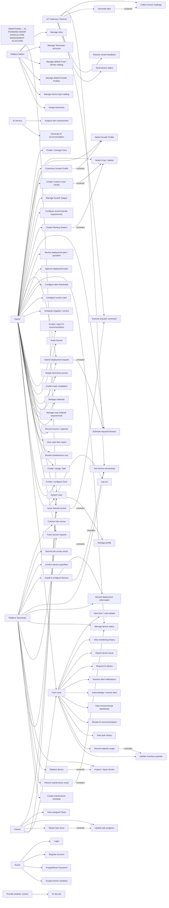

# Overall Use Case - Revised

Source: `SmartFarm_UseCase_Diagram.drawio`.

```mermaid
flowchart LR
  cce5f9f5f13f4c["SMARTFARM — AI-POWERED SMART AGRICULTURE MANAGEMENT PLATFORM"]
  n_7e706eb8164f49["Owner"]
  n_93c4bcf4b4724c["Farmer"]
  a8e93dba522340["Platform Admin"]
  n_174d88125e8746["Platform Technician"]
  fd7648c5424346["IoT Gateway / Devices"]
  facd9efd8a4c4f["AI Service"]
  n_0350a8f3e20f42["Log out"]
  n_573de922640c4e["Manage profile"]
  d1472d338bbb43["Manage roles"]
  n_0ef7fd39c7fc4c["Manage Technician accounts"]
  d468f79a776d41["Create / manage Farm"]
  n_2dd97f988d6941["Select Crop / Variety"]
  n_4b3a084e5af149["Select Growth Profile"]
  n_0a0bfdb6edef4b["Customize Growth Profile"]
  eadcb94f823141["Create Custom Crop / Variety"]
  fe6785a08b5545["Manage Growth Stages"]
  ecd2f6fefe9647["Configure environmental requirements"]
  n_6393cf5c5c5c44["Create Planting Season"]
  e6e6d08feb0941["View farm / zone details"]
  n_50d225e1c66740["Manage default Crop / Variety catalog"]
  a575e2a040d642["Manage default Growth Profiles"]
  n_9cdba628c22a41["Manage device type catalog"]
  n_10ee7b20f03149["Estimate required devices"]
  n_341bd34b9bf746["Conduct site survey"]
  f1a489de16764b["Record site survey result"]
  n_626e0aa7b4c145["Confirm device quantities"]
  c9a06ee673a643["Review deployment plan / quotation"]
  ee237b47be844f["Approve deployment plan"]
  n_053a4845dd7649["Install & configure devices"]
  b94c6bcb46c748["Test device connectivity"]
  eaf79e882b1f4d["Record deployment information"]
  n_54d74926210248["Manage device status"]
  n_151b11de25044e["Collect sensor readings"]
  e6d5d08f9e6948["View environmental dashboard"]
  n_3bd627438a4846["Configure alert thresholds"]
  n_74349cab6f0344["Generate alert"]
  n_1322dff65ae740["Receive alert notifications"]
  n_9a63a8338bc243["Acknowledge / resolve alert"]
  n_239cf9301d834e["View monitoring history"]
  f4a03e59aa2e48["Configure control rules"]
  n_053d2dac977045["Schedule irrigation / control"]
  n_4fbc9a755c514b["Issue manual control"]
  e137ec320f0f4b["Execute actuator command"]
  n_3bb4c97186d54c["Receive control feedback"]
  n_6ec7982c862244["Analyze farm environment"]
  n_4f716387e4394d["Generate AI recommendation"]
  n_2c3bca4cdff84b["Review AI recommendation"]
  n_78c8f928a09d40["Accept / reject AI recommendation"]
  e4e983a42a2341["Request AI advice"]
  n_95e68b9e517546["Invite Farmer"]
  a8eea8bb2dfb4d["Assign farm/zone access"]
  aca601624f2d4b["Create / assign Task"]
  f4f0afefb65d4f["View assigned Tasks"]
  c22379f0340049["Update task progress"]
  n_27878588ffc249["Report task issue"]
  c61a9d7c2bd74c["Confirm task completion"]
  n_6350a0bee6c841["Manage materials"]
  n_48b12acc0a664e["Manage crop material requirements"]
  n_0b4e6d35204f4c["Record material usage"]
  d1790096336a4a["Update inventory quantity"]
  n_607acca708674e["Record income / expense"]
  n_0fa075a6024942["View cash-flow report"]
  e83b02254a4846["Assign technician"]
  n_909232b75d9c44["Track service request"]
  n_6063434b64494f["Inspect / repair device"]
  n_55f93f36dca642["Replace device"]
  n_720a5a1d3b8749["Record maintenance result"]
  n_7c44e170c7a249["Review maintenance cost"]
  n_4b0111a261bc45["Create maintenance schedule"]
  n_3ed9dca0c9f54b["Report device issue"]
  c90e7a32d42346["View task history"]
  be13fe504ceb46["Send device status"]
  n_62d674136feb4e["Submit deployment request"]
  n_734ed790cf484a["Create / configure Zone"]
  _l8ur8XnqWDGPxotTmPI_2["Farm User"]
  rkFsVP6OIOZTz3xUw1lh_3["Guest"]
  rkFsVP6OIOZTz3xUw1lh_4["Login"]
  rkFsVP6OIOZTz3xUw1lh_6["Register Account"]
  rkFsVP6OIOZTz3xUw1lh_8["Forgot/Reset Password"]
  rkFsVP6OIOZTz3xUw1lh_10["Accept Farmer Invitation"]
  rkFsVP6OIOZTz3xUw1lh_12["System User"]
  SqvkGJZ0KRnLjVrRX2fw_1["AI Service"]
  SqvkGJZ0KRnLjVrRX2fw_2["Provide weather context"]
  a8e93dba522340 --> rkFsVP6OIOZTz3xUw1lh_12
  a8e93dba522340 --> d1472d338bbb43
  a8e93dba522340 --> n_0ef7fd39c7fc4c
  n_7e706eb8164f49 --> d468f79a776d41
  n_7e706eb8164f49 --> n_2dd97f988d6941
  n_7e706eb8164f49 --> n_4b3a084e5af149
  n_7e706eb8164f49 --> n_0a0bfdb6edef4b
  n_7e706eb8164f49 --> eadcb94f823141
  n_7e706eb8164f49 --> fe6785a08b5545
  n_7e706eb8164f49 --> ecd2f6fefe9647
  n_7e706eb8164f49 --> n_6393cf5c5c5c44
  a8e93dba522340 --> n_50d225e1c66740
  a8e93dba522340 --> a575e2a040d642
  a8e93dba522340 --> n_9cdba628c22a41
  n_7e706eb8164f49 --> n_10ee7b20f03149
  n_7e706eb8164f49 --> n_62d674136feb4e
  n_174d88125e8746 --> n_341bd34b9bf746
  n_174d88125e8746 --> f1a489de16764b
  n_174d88125e8746 --> n_626e0aa7b4c145
  n_7e706eb8164f49 --> c9a06ee673a643
  n_7e706eb8164f49 --> ee237b47be844f
  n_174d88125e8746 --> n_053a4845dd7649
  n_174d88125e8746 --> b94c6bcb46c748
  fd7648c5424346 --> b94c6bcb46c748
  n_174d88125e8746 --> eaf79e882b1f4d
  n_174d88125e8746 --> n_54d74926210248
  n_7e706eb8164f49 --> n_54d74926210248
  fd7648c5424346 --> n_151b11de25044e
  n_7e706eb8164f49 --> n_3bd627438a4846
  fd7648c5424346 --> n_74349cab6f0344
  n_7e706eb8164f49 --> f4a03e59aa2e48
  n_7e706eb8164f49 --> n_053d2dac977045
  n_7e706eb8164f49 --> n_4fbc9a755c514b
  n_93c4bcf4b4724c --> n_4fbc9a755c514b
  fd7648c5424346 --> e137ec320f0f4b
  fd7648c5424346 --> n_3bb4c97186d54c
  facd9efd8a4c4f --> n_6ec7982c862244
  facd9efd8a4c4f --> n_4f716387e4394d
  n_7e706eb8164f49 --> n_78c8f928a09d40
  n_7e706eb8164f49 --> n_95e68b9e517546
  n_7e706eb8164f49 --> a8eea8bb2dfb4d
  n_93c4bcf4b4724c --> f4f0afefb65d4f
  n_93c4bcf4b4724c --> c22379f0340049
  n_93c4bcf4b4724c --> n_27878588ffc249
  n_7e706eb8164f49 --> c61a9d7c2bd74c
  n_7e706eb8164f49 --> n_6350a0bee6c841
  n_7e706eb8164f49 --> n_48b12acc0a664e
  n_7e706eb8164f49 --> n_607acca708674e
  n_7e706eb8164f49 --> n_0fa075a6024942
  a8e93dba522340 --> e83b02254a4846
  n_7e706eb8164f49 --> n_909232b75d9c44
  n_174d88125e8746 --> n_909232b75d9c44
  n_174d88125e8746 --> n_6063434b64494f
  n_174d88125e8746 --> n_55f93f36dca642
  n_174d88125e8746 --> n_720a5a1d3b8749
  n_7e706eb8164f49 --> n_7c44e170c7a249
  n_174d88125e8746 --> n_4b0111a261bc45
  fd7648c5424346 --> be13fe504ceb46
  n_7e706eb8164f49 --> aca601624f2d4b
  n_62d674136feb4e --> |«include»| n_10ee7b20f03149
  n_053a4845dd7649 --> |«include»| eaf79e882b1f4d
  n_053a4845dd7649 --> |«include»| b94c6bcb46c748
  n_4fbc9a755c514b --> |«include»| e137ec320f0f4b
  n_0b4e6d35204f4c --> |«include»| d1790096336a4a
  n_720a5a1d3b8749 --> |«include»| n_54d74926210248
  n_6393cf5c5c5c44 --> |«include»| n_2dd97f988d6941
  n_0a0bfdb6edef4b --> |«extend»| n_4b3a084e5af149
  eadcb94f823141 --> |«extend»| n_2dd97f988d6941
  n_27878588ffc249 --> |«extend»| c22379f0340049
  n_55f93f36dca642 --> |«extend»| n_6063434b64494f
  n_74349cab6f0344 --> |«extend»| n_151b11de25044e
  n_7e706eb8164f49 --> n_62d674136feb4e
  n_7e706eb8164f49 --> n_734ed790cf484a
  _l8ur8XnqWDGPxotTmPI_2 --> e6e6d08feb0941
  _l8ur8XnqWDGPxotTmPI_2 --> n_239cf9301d834e
  _l8ur8XnqWDGPxotTmPI_2 --> n_3ed9dca0c9f54b
  _l8ur8XnqWDGPxotTmPI_2 --> e4e983a42a2341
  _l8ur8XnqWDGPxotTmPI_2 --> n_1322dff65ae740
  _l8ur8XnqWDGPxotTmPI_2 --> n_9a63a8338bc243
  _l8ur8XnqWDGPxotTmPI_2 --> e6d5d08f9e6948
  _l8ur8XnqWDGPxotTmPI_2 --> n_2c3bca4cdff84b
  _l8ur8XnqWDGPxotTmPI_2 --> c90e7a32d42346
  _l8ur8XnqWDGPxotTmPI_2 --> n_0b4e6d35204f4c
  _l8ur8XnqWDGPxotTmPI_2 --> d1790096336a4a
  n_93c4bcf4b4724c --> _l8ur8XnqWDGPxotTmPI_2
  n_7e706eb8164f49 --> _l8ur8XnqWDGPxotTmPI_2
  rkFsVP6OIOZTz3xUw1lh_3 --> rkFsVP6OIOZTz3xUw1lh_4
  rkFsVP6OIOZTz3xUw1lh_3 --> rkFsVP6OIOZTz3xUw1lh_6
  rkFsVP6OIOZTz3xUw1lh_3 --> rkFsVP6OIOZTz3xUw1lh_8
  rkFsVP6OIOZTz3xUw1lh_3 --> rkFsVP6OIOZTz3xUw1lh_10
  rkFsVP6OIOZTz3xUw1lh_12 --> n_0350a8f3e20f42
  rkFsVP6OIOZTz3xUw1lh_12 --> n_573de922640c4e
  n_174d88125e8746 --> rkFsVP6OIOZTz3xUw1lh_12
  n_7e706eb8164f49 --> rkFsVP6OIOZTz3xUw1lh_12
  n_93c4bcf4b4724c --> rkFsVP6OIOZTz3xUw1lh_12
  SqvkGJZ0KRnLjVrRX2fw_2 --> SqvkGJZ0KRnLjVrRX2fw_1
```
