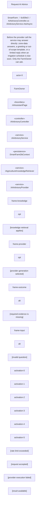

# Request AI Advice

Source: `02-sequence-diagrams-v2.drawio`.

```mermaid
flowchart LR
  title["Request AI Advice"]
  source["SmartFarm  /  6c839e3  /  AiAdvisoryController.cs · AiAdvisoryService.AskAsync"]
  implementation_note["Before the provider call the service may answer directly: zone-data answers, a greeting or out-of-scope template, or a limited reply when an irrigation schedule is due soon. Only the FarmOwner can ask."]
  actor_0["actor-0"]
  actor_label_0["FarmOwner"]
  participant_1["«boundary»<br/>:AIAssistantPage"]
  participant_2["«controller»<br/>:AiAdvisoryController"]
  participant_3["«service»<br/>:AiAdvisoryService"]
  participant_4["«persistence»<br/>:SmartFarmDbContext"]
  participant_5["«service»<br/>:IAgricultureKnowledgeRetriever"]
  participant_6["«service»<br/>:IAiAdvisoryProvider"]
  frame_knowledge["frame-knowledge"]
  tab_knowledge["opt"]
  guard_knowledge["[knowledge retrieval applies]"]
  frame_provider["frame-provider"]
  tab_provider["opt"]
  guard_provider["[provider generation selected]"]
  frame_outcome["frame-outcome"]
  tab_outcome["alt"]
  guard_outcome["[required evidence is missing]"]
  frame_input["frame-input"]
  tab_input["alt"]
  guard_input["[invalid question]"]
  activation_0["activation-0"]
  activation_1["activation-1"]
  activation_2["activation-2"]
  activation_3["activation-3"]
  activation_4["activation-4"]
  activation_5["activation-5"]
  otherwise_507["[rate limit exceeded]"]
  otherwise_629["[request accepted]"]
  otherwise_1084["[provider execution failed]"]
  otherwise_1163["[result available]"]
```
