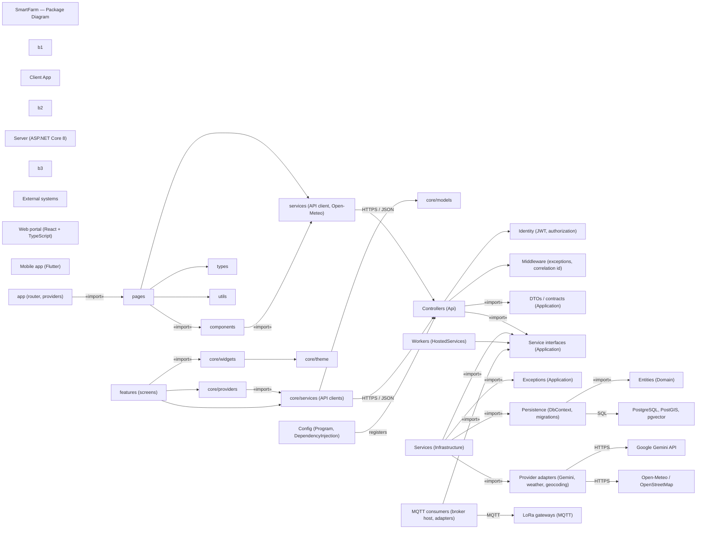

# Package Diagram

Source: `09-package-diagram.drawio`.

```mermaid
flowchart LR
  title["SmartFarm — Package Diagram"]
  b1["b1"]
  b1t["Client App"]
  b2["b2"]
  b2t["Server (ASP.NET Core 8)"]
  b3["b3"]
  b3t["External systems"]
  g1["Web portal (React + TypeScript)"]
  g2["Mobile app (Flutter)"]
  w_app["app (router, providers)"]
  w_pages["pages"]
  w_comp["components"]
  w_types["types"]
  w_utils["utils"]
  w_serv["services (API client, Open-Meteo)"]
  m_feat["features (screens)"]
  m_widg["core/widgets"]
  m_theme["core/theme"]
  m_prov["core/providers"]
  m_serv["core/services (API clients)"]
  m_mod["core/models"]
  s_sec["Identity (JWT, authorization)"]
  s_ctrl["Controllers (Api)"]
  s_mid["Middleware (exceptions, correlation id)"]
  s_cfg["Config (Program, DependencyInjection)"]
  s_dto["DTOs / contracts (Application)"]
  s_if["Service interfaces (Application)"]
  s_exc["Exceptions (Application)"]
  s_svc["Services (Infrastructure)"]
  s_wrk["Workers (HostedServices)"]
  s_con["MQTT consumers (broker host, adapters)"]
  s_ent["Entities (Domain)"]
  s_per["Persistence (DbContext, migrations)"]
  s_ada["Provider adapters (Gemini, weather, geocoding)"]
  x_db["PostgreSQL, PostGIS, pgvector"]
  x_ai["Google Gemini API"]
  x_wx["Open-Meteo / OpenStreetMap"]
  x_gw["LoRa gateways (MQTT)"]
  w_app --> |«import»| w_pages
  w_pages --> |«import»| w_comp
  w_pages --> w_serv
  w_comp --> |«import»| w_serv
  w_pages --> w_types
  w_pages --> w_utils
  m_feat --> |«import»| m_widg
  m_widg --> m_theme
  m_feat --> m_prov
  m_prov --> |«import»| m_serv
  m_serv --> m_mod
  m_feat --> m_serv
  w_serv --> |HTTPS / JSON| s_ctrl
  m_serv --> |HTTPS / JSON| s_ctrl
  s_ctrl --> s_sec
  s_ctrl --> s_mid
  s_ctrl --> |«import»| s_if
  s_ctrl --> |«import»| s_dto
  s_svc --> |«import»| s_if
  s_svc --> |«import»| s_exc
  s_svc --> |«import»| s_per
  s_svc --> |«import»| s_ada
  s_per --> |«import»| s_ent
  s_wrk --> s_if
  s_con --> |«import»| s_if
  s_cfg --> |registers| s_ctrl
  s_per --> |SQL| x_db
  s_ada --> |HTTPS| x_ai
  s_ada --> |HTTPS| x_wx
  s_con --> |MQTT| x_gw
```
