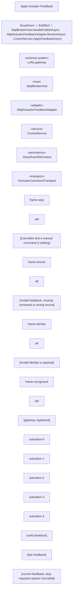

# Apply Actuator Feedback

Source: `02-sequence-diagrams-v2.drawio`.

```mermaid
flowchart LR
  title["Apply Actuator Feedback"]
  source["SmartFarm  /  6c839e3  /  MqttBrokerHost.HandlePublishAsync · MqttActuatorFeedbackAdapter.ReceiveAsync · ControlService.ApplyFeedbackAsync"]
  participant_0["«external system»<br/>LoRa gateway"]
  participant_1["«host»<br/>:MqttBrokerHost"]
  participant_2["«adapter»<br/>:MqttActuatorFeedbackAdapter"]
  participant_3["«service»<br/>:ControlService"]
  participant_4["«persistence»<br/>:SmartFarmDbContext"]
  participant_5["«transport»<br/>:IActuatorCommandTransport"]
  frame_stop["frame-stop"]
  tab_stop["opt"]
  guard_stop["[Cancelled and a manual command is waiting]"]
  frame_source["frame-source"]
  tab_source["alt"]
  guard_source["[invalid feedback, missing command or wrong source]"]
  frame_identity["frame-identity"]
  tab_identity["alt"]
  guard_identity["[invalid identity or payload]"]
  frame_recognized["frame-recognized"]
  tab_recognized["opt"]
  guard_recognized["[gateway registered]"]
  activation_0["activation-0"]
  activation_1["activation-1"]
  activation_2["activation-2"]
  activation_3["activation-3"]
  activation_4["activation-4"]
  otherwise_501["[valid feedback]"]
  otherwise_703["[late feedback]"]
  otherwise_782["[current feedback; stop requests require Cancelled]"]
```
