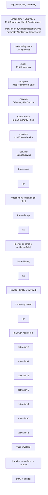

# Ingest Gateway Telemetry

Source: `02-sequence-diagrams-v2.drawio`.

```mermaid
flowchart LR
  title["Ingest Gateway Telemetry"]
  source["SmartFarm  /  6c839e3  /  MqttBrokerHost.HandlePublishAsync · MqttTelemetryAdapter.ReceiveAsync · TelemetryAlertService.IngestAsync"]
  participant_0["«external system»<br/>LoRa gateway"]
  participant_1["«host»<br/>:MqttBrokerHost"]
  participant_2["«adapter»<br/>:MqttTelemetryAdapter"]
  participant_3["«service»<br/>:TelemetryAlertService"]
  participant_4["«persistence»<br/>:SmartFarmDbContext"]
  participant_5["«service»<br/>:INotificationService"]
  participant_6["«service»<br/>:ControlService"]
  frame_alert["frame-alert"]
  tab_alert["opt"]
  guard_alert["[threshold rule creates an alert]"]
  frame_dedup["frame-dedup"]
  tab_dedup["alt"]
  guard_dedup["[device or sample validation fails]"]
  frame_identity["frame-identity"]
  tab_identity["alt"]
  guard_identity["[invalid identity or payload]"]
  frame_registered["frame-registered"]
  tab_registered["opt"]
  guard_registered["[gateway registered]"]
  activation_0["activation-0"]
  activation_1["activation-1"]
  activation_2["activation-2"]
  activation_3["activation-3"]
  activation_4["activation-4"]
  activation_5["activation-5"]
  activation_6["activation-6"]
  otherwise_501["[valid envelope]"]
  otherwise_746["[duplicate envelope or sample]"]
  otherwise_868["[new readings]"]
```
