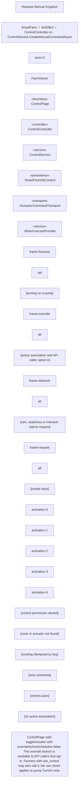

# Request Manual Irrigation

Source: `02-sequence-diagrams-v2.drawio`.

```mermaid
flowchart LR
  title["Request Manual Irrigation"]
  source["SmartFarm  /  6c839e3  /  ControlController.cs · ControlService.CreateManualCommandAsync"]
  actor_0["actor-0"]
  actor_label_0["FarmOwner"]
  participant_1["«boundary»<br/>:ControlPage"]
  participant_2["«controller»<br/>:ControlController"]
  participant_3["«service»<br/>:ControlService"]
  participant_4["«persistence»<br/>:SmartFarmDbContext"]
  participant_5["«transport»<br/>:IActuatorCommandTransport"]
  participant_6["«service»<br/>:IRainForecastProvider"]
  frame_forecast["frame-forecast"]
  tab_forecast["opt"]
  guard_forecast["[turning on a pump]"]
  frame_override["frame-override"]
  tab_override["alt"]
  guard_override["[active automation and API caller opted in]"]
  frame_interlock["frame-interlock"]
  tab_interlock["alt"]
  guard_interlock["[rain, readiness or interlock rejects request]"]
  frame_request["frame-request"]
  tab_request["alt"]
  guard_request["[invalid input]"]
  activation_0["activation-0"]
  activation_1["activation-1"]
  activation_2["activation-2"]
  activation_3["activation-3"]
  activation_4["activation-4"]
  otherwise_507["[control permission denied]"]
  otherwise_629["[zone or actuator not found]"]
  otherwise_751["[existing idempotency key]"]
  otherwise_873["[new command]"]
  otherwise_1266["[checks pass]"]
  otherwise_1597["[no active automation]"]
  implementation_note["ControlPage calls toggleActuator with overrideActiveSchedules=false. The override branch is available to API callers that opt in. Farmers with can_control may also call it; the rain check applies to pump TurnOn only."]
```
