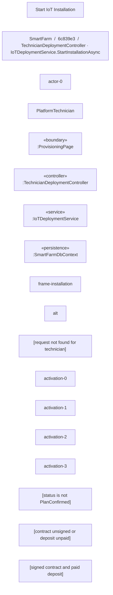

# Start IoT Installation

Source: `02-sequence-diagrams-v2.drawio`.

```mermaid
flowchart LR
  title["Start IoT Installation"]
  source["SmartFarm  /  6c839e3  /  TechnicianDeploymentController · IoTDeploymentService.StartInstallationAsync"]
  actor_0["actor-0"]
  actor_label_0["PlatformTechnician"]
  participant_1["«boundary»<br/>:ProvisioningPage"]
  participant_2["«controller»<br/>:TechnicianDeploymentController"]
  participant_3["«service»<br/>:IoTDeploymentService"]
  participant_4["«persistence»<br/>:SmartFarmDbContext"]
  frame_installation["frame-installation"]
  tab_installation["alt"]
  guard_installation["[request not found for technician]"]
  activation_0["activation-0"]
  activation_1["activation-1"]
  activation_2["activation-2"]
  activation_3["activation-3"]
  otherwise_507["[status is not PlanConfirmed]"]
  otherwise_629["[contract unsigned or deposit unpaid]"]
  otherwise_751["[signed contract and paid deposit]"]
```
