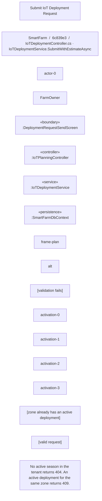

# Submit IoT Deployment Request

Source: `02-sequence-diagrams-v2.drawio`.

```mermaid
flowchart LR
  title["Submit IoT Deployment Request"]
  source["SmartFarm  /  6c839e3  /  IoTDeploymentController.cs · IoTDeploymentService.SubmitWithEstimateAsync"]
  actor_0["actor-0"]
  actor_label_0["FarmOwner"]
  participant_1["«boundary»<br/>:DeploymentRequestSendScreen"]
  participant_2["«controller»<br/>:IoTPlanningController"]
  participant_3["«service»<br/>:IoTDeploymentService"]
  participant_4["«persistence»<br/>:SmartFarmDbContext"]
  frame_plan["frame-plan"]
  tab_plan["alt"]
  guard_plan["[validation fails]"]
  activation_0["activation-0"]
  activation_1["activation-1"]
  activation_2["activation-2"]
  activation_3["activation-3"]
  otherwise_507["[zone already has an active deployment]"]
  otherwise_629["[valid request]"]
  implementation_note["No active season in the tenant returns 404. An active deployment for the same zone returns 409."]
```
